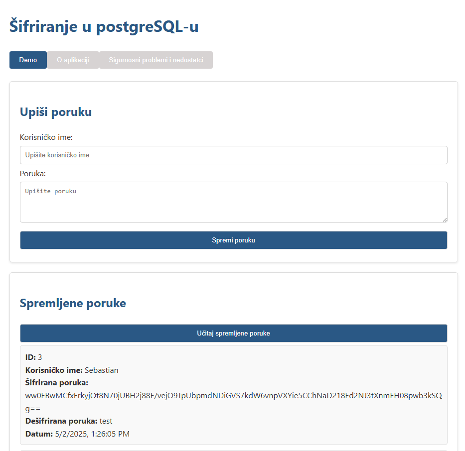
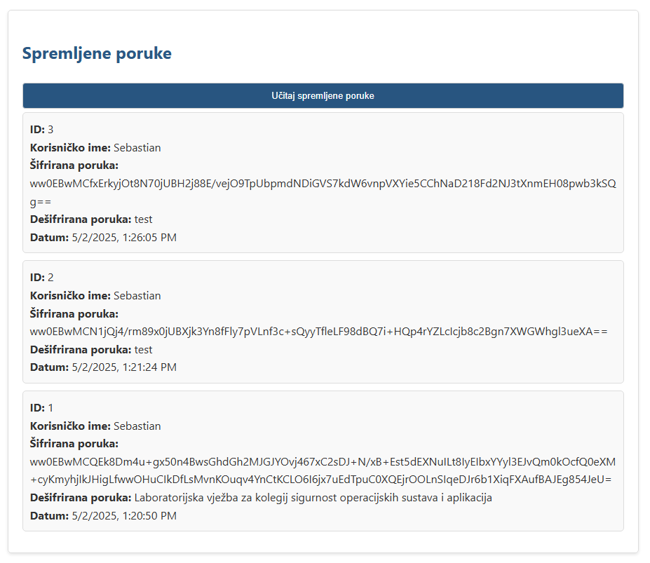
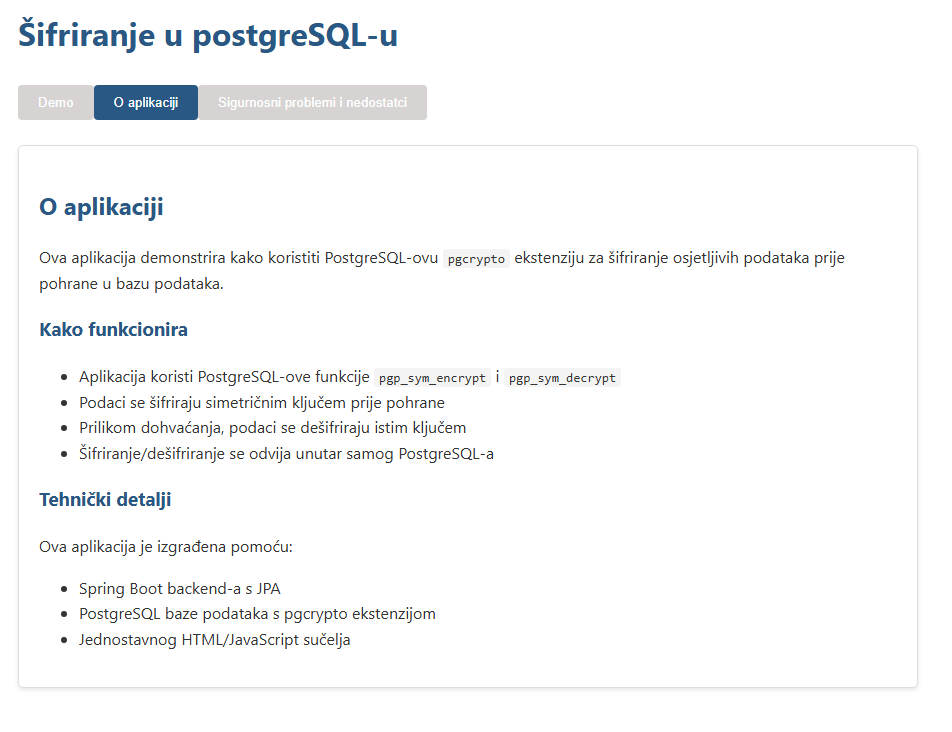
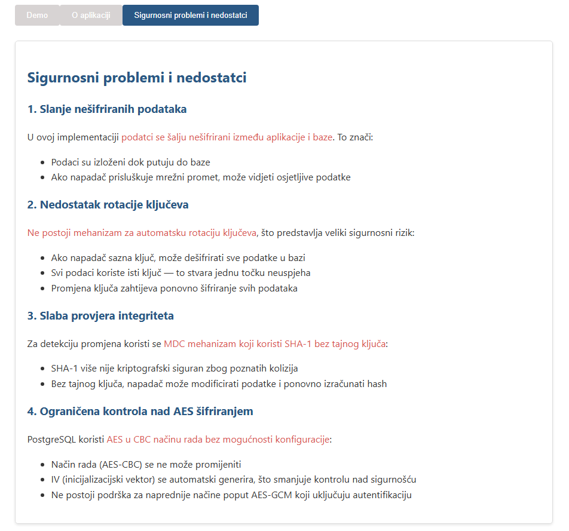

# Šifriranje u postgreSQL-u

# Postavljanje baze podataka
- pokrenite pgAdmin ili slično okruženje u kojem možete upravljati PostgreSQL bazom podataka
- napravite novu bazu podataka s nazivom 'Encryption-postgreSQL'
- otvorite query tool i pokrenite sljedeći SQL upit:
```sql
CREATE EXTENSION IF NOT EXISTS pgcrypto;

CREATE TABLE messages (
    id SERIAL PRIMARY KEY,
    sender VARCHAR(100) NOT NULL,
	plaintext_message text,
    encrypted_message BYTEA,
    created_at TIMESTAMP DEFAULT CURRENT_TIMESTAMP
);

CREATE OR REPLACE FUNCTION encrypt_message_func() 
RETURNS TRIGGER AS $$
DECLARE
    encryption_key TEXT := 'very_strong_secret_key789';
BEGIN
    IF NEW.plaintext_message IS NOT NULL THEN
        NEW.encrypted_message := pgp_sym_encrypt(NEW.plaintext_message, encryption_key);
		NEW.plaintext_message := NULL;
    END IF;
    
    RETURN NEW;
END;
$$ LANGUAGE plpgsql;

CREATE TRIGGER encrypt_message_trigger
BEFORE INSERT OR UPDATE ON messages
FOR EACH ROW
EXECUTE FUNCTION encrypt_message_func();

CREATE OR REPLACE FUNCTION decrypt_message(encrypted_msg BYTEA) 
RETURNS TEXT AS $$
DECLARE
    encryption_key TEXT := 'very_strong_secret_key789';
    decrypted TEXT;
BEGIN
    BEGIN
        decrypted := pgp_sym_decrypt(encrypted_msg, encryption_key);
        RETURN decrypted;
    EXCEPTION
        WHEN OTHERS THEN
            RETURN 'Decryption failed - incorrect key or corrupted data';
    END;
END;
$$ LANGUAGE plpgsql;
```
- ovim upitom se stvara tablica `messages` i funkcija za šifriranje i dešifriranje poruka
- funkcija `encrypt_message_func` automatski šifrira poruku prilikom umetanja ili ažuriranja redaka

# Postavljanje okruženja
- aplikacija je Spring Boot projekt koji koristi Java 17 i Maven
- provjerite imate li instalirane JDK 17 i Maven
- klonirajte repozitorij
- postavite Spring boot projekt
- promijenite varijable okruženja DB_PASS i DB_USERNAME kako bi ste se mogli spojiti na bazu podataka
  ili promijenite vrijednosti iza dvotočke u src/main/resources/application.properties
  (ako je šifra 1234 redak sa šifrom će izgledati ovako: `spring.datasource.password=${DB_PASS:1234}`)
- pokrenite aplikaciju
- otvorite preglednik i idite na `http://localhost:8080/api`

# Izgled aplikacije
Demo aplikacije



O aplikaciji


Sigurnosni problemi i nedostatci
